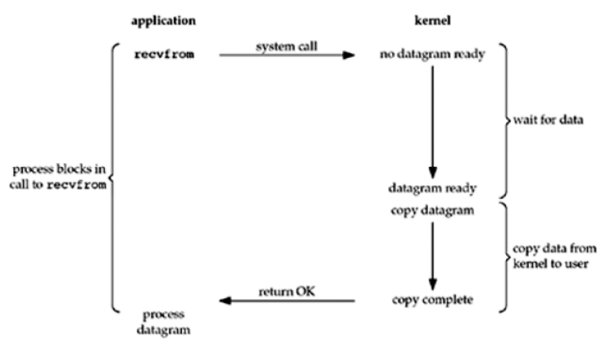
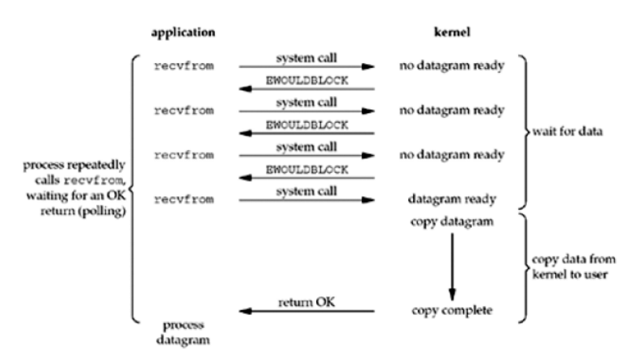
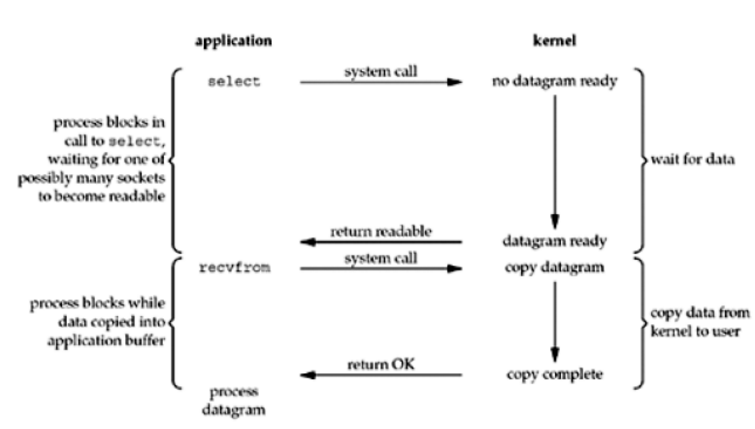
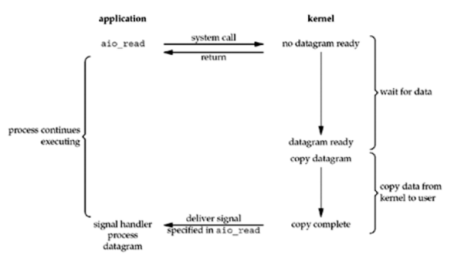

# 理解IO多路复用

## socket
我们都知道unix世界里，一切皆文件，而文件是什么呢？文件就是一串二进制流而已，不管socket，还是FIFO、管道、终端，对我们来说，一切皆文件，一切皆流。在信息交换的过程中，我们都是对这些流进行数据的收发操作，简称I/O操作（imput and output），往流中读取数据，系统调用read，写入数据，系统调用write。不过，计算机里有这么多流，我们怎么知道要操作哪个流呢？对，就是文件描述符，即通常所说的fd，一个fd就是一个整数，所以，对这个整数的操作，就是对这个文件（流）的操作。我们创建一个socket，通过系统调用会返回一个文件描述符，那么剩下对socket的操作就会转化为对这个描述符的操作。
## 阻塞
什么是程序的阻塞呢？想象这种情形，比如你等快递，但快递一直没来，你会怎么做？有两种方式
- 快递没来，我可以先去睡觉，然后快递来了给我打电话叫我去取就行了
- 快递没来，我就不停的给快递打电话说：怎么还没来，给老子快点。直到快递来
很显然，你无法忍受第二种方式，不仅耽搁自己的时间，也会让快递很想打你。而在计算机世界，这两种情形就对应阻塞和非阻塞忙轮询。
- 非阻塞忙轮询：数据没来，进程就不停的去检测数据，直到数据来。
- 阻塞：数据没来，啥也不做，直到数据来，才做进一步处理。
先说说阻塞，因为一个线程只能处理一个套接字的I/O事件，如果想同时处理多个，可以利用非阻塞忙轮询的方式，伪代码如下：
```c
while true
{
    for i in stream[]
    {
        if i has data
        read until unavailable
    }
}
```
我们只要把所有流从头到尾查询一遍，就可以处理多个流了，但这样做很不好，因为如果所有的流都没有I/O事件，拜拜浪费CPU时间片。正如一位科学家所说，计算机所有的问题都可以增加一个中间层来解决，同样，为了避免这里CPU的空转，我们不让这个线程亲自去检查流中是否有事件，而是引进一个代理（一开始是select，后来是poll），这个代理很牛，它可以同时观察许多流的I/O事件，如果没有事件，代理就阻塞，线程就不会挨个去轮询了，伪代码如下：
```c
while true
{
    select(streams[]) //这一步死在这里，知道有一个流有I/O事件时，才往下执行
    for i in streams[]
    {
        if i has data
        read until unavailable
    }
}
```
但是依然有个问题，我们从select那里仅仅知道了，有I/O事件发生了，却并不知道哪个流，我们只能无差别轮询所有流，找出能读出数据，或者写入数据的流，对他们进行操作。所以select具有O(n)的无差别轮询复杂度，同时处理的流越多，无差别轮询时间就越长。

epoll可以理解为event poll，不同于忙轮询和无差别轮询，epoll会把哪个流发生了怎么样的I/O事件通知我们。所以我们说epoll实际上是事件驱动（每个时间关联上fd）的，此时我们对这些流的操作都是有意义的。复杂度降低到了O(1)，伪代码如下：
```c
while true
{
    activate_stream[] = epoll_wait(epollfd)
    for i in activate_stream[]
    {
        read or write till
    }
}
```

可以看到，select和epoll最大的区别就是：select只是告诉你一定数目的流有事件了，至于哪个流有事件，还得一个一个去轮询，而epoll会把发生的事件告诉你，通过发生的事件，就自然而然定位到哪个流了。不得不说epoll跟select相比，是质的飞跃，我觉得这也是一种牺牲空间，换区时间的思想，毕竟现在硬件越来越便宜了。
## I/O多路复用
输入操作一般包含两个步骤：
1. 等待数据准备好（waiting for data to be ready），对于一个套接口上的操作，这一步骤关系到数据从网络到达，并将其复制到内核的某个缓冲区。
2. 将数据从内核缓冲区复制到进程缓冲区（copying the data from the kernel to the process）。

下面了解一下常用的3种I/O模型

### 阻塞I/O模型
最广泛的模型是阻塞I/O模型，默认情况下，所有套接口都是阻塞的。进程调用recvfrom系统调用，整个过程是阻塞的，直到数据复制到进程缓冲区时才返回（当然，系统调用被中断也会返回）。


### 非阻塞I/O模型
当我们把一个套接口设置为非阻塞时，就是在告诉内核，当请求的I/O操作无法完成时，不要将进程睡眠，而是返回一个错误。当数据没有准备好时，内核立即返回EWOULDBLOCK错误，第四次调用系统调用时，数据已经存在，这是数据复制到进程缓冲区中。这其中有一个操作时轮询（polling）。


### I/O复用模型
此模型用到select和poll函数，这两个函数也会使进程阻塞，select先阻塞，有活动套接字才返回，但是和阻塞I/O不同的是，这两个函数可以同时阻塞多个I/O操作，而且可以同时对多个读操作，多个写操作的I/O函数进行检测，直到有数据可读或可写（就是监听多个socket）。select被调用后，进程会被阻塞，内核监视所有select负责的socket，当有任何一个socket的数据准备好了，select就会返回套接字可读，我们就可以调用recvfrom处理数据。

正因为阻塞I/O只能阻塞一个I/O操作，而I/O复用模型能够阻塞多个I/O操作，所以才叫做多路复用。



### 信号驱动I/O模型（signal driven I/O，SIGIO）
首先我们允许套接口进行信号驱动I/O，并安装一个信号处理函数，进程继续运行并不阻塞。当数据准备好时，进程会收到一个SIGIO信号，可以在信号处理函数中调用I/O操作函数处理数据。当数据报准备好读取时，内核就为该进程产生一个SIGIO信号。我们随后既可以在信号处理函数中调用recvfrom读取数据报，并通知主循环数据已准备好待处理，也可以立即通知主循环，让它来读取数据报。无论如何处理SIGIO信号，这种模型的优势在于等待数据报到达（第一阶段）期间，进程可以继续执行，不被阻塞。免去了select的阻塞与轮询，当有活跃套接字时，由注册的handler处理。


### 异步I/O模型（AIO，asynchronous I/O）
进程发起read操作之后，立刻就开始去做其它的事。而另一方面，从kernel的角度，当它收到一个asyncronous read之后，首先它会立刻返回，所以不会对用户进程产生任何block。然后，kernel会等待数据准备完成，然后将数据拷贝到用户内存，当这一切都完成之后，kernel会给用户进程发送一个signal，告诉它read操作完成了。

这个模型工作机制是：告诉内核启动某个操作，并让内核在整个操作（包括第二阶段，即将数据从内核拷贝到进程缓冲区中）完成后通知我们。这种模型和前一种模型区别在于：信号驱动I/O是由内核通知我们何时可以启动一个I/O操作，而异步I/O模型是由内核通知我们I/O操作何时完成。



