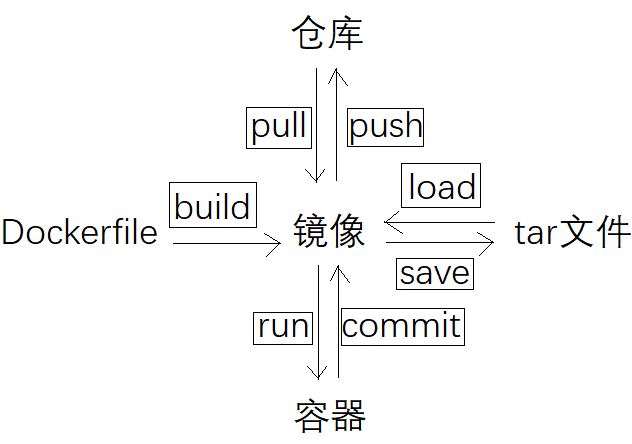

## 基本命令行操作概念


### pull
```
docker pull 镜像(:版本)
```


### run
```
docker run (-d#后台运行)(-p 80:80#端口映射) (--name 容器名) (-v 宿主目录:容器目录) (-d #后台运行) 镜像
```

### ps
```
docker ps (-a #查看所有容器) (-q #返回正在运行容器id) (-qa #返回所有容器的id)#查看正在运行的容器
```

### exec
```
docker exec -it 容器 bash #进入容器执行命令
```

### rm
```
docker rm -f (容器)|($(docker ps -qa)#删除所有容器)
```

### rmi
```
docker rmi 镜像
```

### commit
```
docker commit 容器 镜像
```

### images
```
docker images
```

### build
```
docker build
```

### inspect
```
docker docker inspect #查看容器内部细节
```

### load
```
docker load -i 镜像文件名 #加载镜像文件
```

### start
```
docker start 容器 #启动容器
```

### restart
```
docker restart 容器 #重启容器
```

### stop
```
docker stop 容器 #正常停止容器运行
```

### kill
```
docker kill 容器 #强制停止容器运行
```

### top
```
docker top 容器 #查看容器内的进程
```

### logs
```
docker logs (-t #加入时间戳) (-f #跟随最新的日志打印) （--tail 数字 #显示最后多少条） 容器
```

### cp
```
docker cp 文件|目录 容器:容器内路径 #将宿主机复制到容器内部
docker cp 容器:容器内资源路径 目录 #将容器内资源拷贝到宿主机
```

## dockerfile基本格式

### FROM
```
FROM 镜像(:版本)
```

### WORKDIR
```
WORKDIR 路径 #自动创建运行路径
```

### COPY
```
COPY 宿主机目录 容器目录 #宿主机文件拷贝到容器中
```

### RUN
```
RUN shell #运行shell语句
```

### CMD
```
CMD shell
```

### ADD

### EXPOSE

### VOLUME

### ENV

### ARG

### LABEL
 
### ONBUILD

### SHELL

