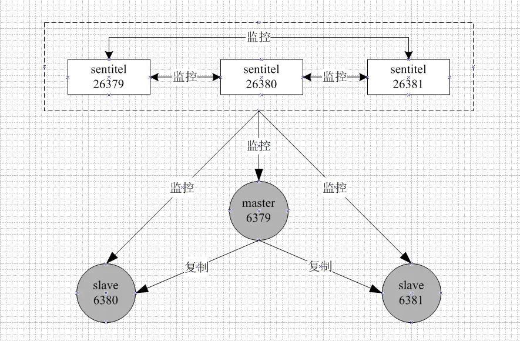
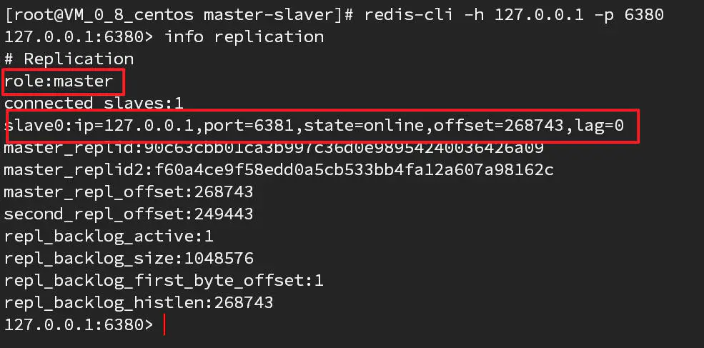
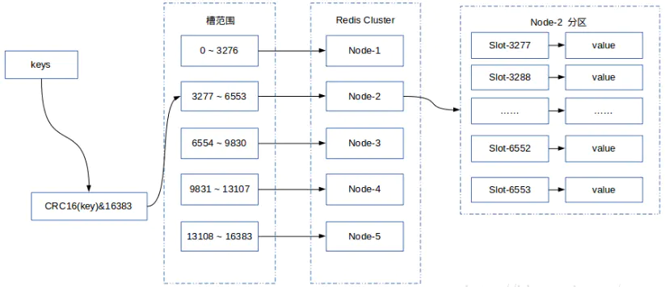

<!--
 * @Author: zhangjiaxi
 * @Date: 2021-03-03 11:13:50
 * @LastEditors: zhangjiaxi
 * @LastEditTime: 2021-03-03 18:00:19
 * @FilePath: /learning_note/redisDistribute.md
 * @Description: 
-->
# Redis分布式指南

## 分布式与集群

目前的项目很少会采用单机架构了，一是因为单机性能有限，二是因为单机服务一旦故障整个系统就无法继续提供服务了。通过分布式架构解决性能（高并发）问题，通过集群架构解决故障服务（高可用）问题。

## 分布式架构

按照类型大致可以分为两种：分布式计算和分布式存储。

分布式计算很好理解，就是将大量激素那任务分配到多个计算单元上以提高总计算性能。例如暴力破解某个密码需要遍历某个字符组合10万次，假设一台计算机需要10分钟，那么10台计算机同时遍历，每台遍历1万次，最后将结果汇总，那么就只需要1分钟。这10台计算机组合起来就是一个分布式计算系统，这里的业务就是计算。

同理，分布式存储就是将大量数据分配到多个存储单元上以提高总存储量。

## 集群架构

集群：同一业务，部署在多个服务器上，这样可以起到两个作用：
- 分散每台服务器的压力
- 任意一台或者几台服务器宕机也不会影响系统

例如一个典型的web集群服务架构图如下：


这里三个web Server实际上都是运行者同一套业务，但是三台服务器就可以显著分散单台服务器压力，并且任意一台宕机也不会导致无法提供服务。

## 分布式与集群的关系

分布式不一定能用上，但是集群一般都是需要的。因为不是所有系统都需要应对高并发场景，但高可用是一个系统能够长期稳定运行基本保障。因此用到分布式架构的系统基本上都会用到集群，而用集群架构的系统却不一定会用到分布式。

## Redis部署指南

### 单节点方案：Redis Standalone

#### 简介
这是最简单的redis部署方案，所以数据存储和读写操作都在同一个redis服务上。
这种方式优点很明显：部署简单，无论是部署成本还是运维成本都很低，本地测试时最常见也是最方便的方式。
但同时缺点也很明显：不能实现高可用，也不能应对高并发场景，也无法轻易水平拓展，数据存储量很容易见顶。

#### 部署实例
```sh
# 下载Redis二进制安装包：
wget http://download.redis.io/releases/redis-5.0.4.tar.gz
# 解压二进制包
tar –zxvf redis-5.0.4.tar.gz
# 进入解压文件夹并编译二进制文件
cd redis-5.0.4
make
# 安装
cd src
make test
make install
```

完成 Redis 的安装，安装完成后用 redis-server -v 验证安装是否成功，若成功输出如下版本信息则代表安装成功：

```sh
Redis server v=5.0.4
```

安装成功就可以直接运行了，但是默认配置下是不支持后台运行的，关掉命令窗口就会结束redis进程，这显然是不行的。所以我们再简单改以下redis的配置，让其能直接后台运行。

```sh
# 进入到 redis 的安装目录，编辑 redis.conf
vim /usr/redis/redis-5.0.4/redis.conf
# 将 daemonize no 修改成 daemonize yes （使 redis 服务可以在后台运行）

# 在指定配置下运行redis服务
/usr/local/bin/redis-server /usr/redis/redis-5.0.4/redis.conf 
# 查看redis运行情况
ps -ef | grep redis

# 输出
app   21794   1  0 Jan28 ?  03:31:25 ./redis-server *:6379
```

### 高可用方案：Redis Sentinel
#### 原理简介
Redis Sentinel是Redis官方推荐的高可用（HA）解决方案，这是生产环境中最实用的也是最常见的方案。

这里涉及到另一个概念：master-slaver（主从模式）。很好理解，就是常用的主备模式，例如nginx的主备模式。一个主redis节点可以配置多个节点，当主节点挂掉时，从节点自动顶上代替主节点，这样就可以有效的避免一个节点挂掉导致整个系统挂掉的问题，实现redis服务的高可用。如下图：


但是这个方案需要解决两个基本问题：

1. 如何提前判断各个节点（尤其是主节点）的运行健康状况？
2. 当主节点宕机的时候如何从多个从节点中选出一个作为新的主节点并实现自动切换？

这时Redis Sentinel应运而生，它主要有以下三个特点：
- 监控(Monitoring)：Sentinel会不断地检查你的主服务器和从服务器是否运作正常。
- 提醒(Notification)：当被监控的某个Redis服务器出现问题时，Sentinel可以通过API向管理员或者其他应用程序发送通知。
- 自动故障迁移(Automatic failover)：当一个主服务器不能正常工作时，Sentinel会开始一次自动故障迁移操作，它会将失效主服务器的其中一个从服务器升级为新的主服务器，并让失效主服务器的其他从服务器改为复制新的主服务器；当客户端试图连接失效的主服务器时，集群也会向客户端返回新主服务器的地址，使得集群可以使用新主服务器代替失效服务器。

总结来说就是sentinrl可以监控一个或者多个master-slaver集群，定时对每个节点进行健康检查，可以通过API发送通知，并自动进行故障转移。这时redis结构就变成了使用redis sentinel之后客户端不再直接连接redis节点获取服务，而是使用sentinel代理获取redis服务，类似nginx的代理模式。那么这里又有一个新问题，就是如果sentinel宕机了，那么客户端就找不到redis服务了，所以sentinel本身也是需要支持高可用。

好在sentinel本身也支持集群部署，并且各个sentinel之间支持自动监控，如此一来redis主从服务和sentinel服务都可以支持高可用。预期结构如下：


#### 部署实例
master-slaver 一主二从
那么下面来实操以下，以下过程大部分参考redis官方[Redis Sentinel文档](https://links.jianshu.com/go?to=https%3A%2F%2Fredis.io%2Ftopics%2Fsentinel%23redis-sentinel-documentation)

redis解压后，redis home目录下有redsi配置的样例文件，我们不直接在次文件上进行修改，在redis home目录下新建文件夹master-slave，将配置文件都放于此目录下，下面是三个redis节点配置的关键部分。

- master配置文件：redis-6379.conf
```
port 6379
daemonize yes
logfile "6379.log"
dbfilename "dump-6379.rdb"
dir "/opt/soft/redis/data"
```

- slave-1 配置文件：redis-6380.conf
```
port 6380
daemonize yes
logfile "6380.log"
dbfilename "dump-6380.rdb"
dir "/opt/soft/redis/data"
# 关键配置：将这个 redis 指定为某个第一个 redis 的 slaver
slaveof 127.0.0.1 6379
```

- slave-2 配置文件：redis-6381.conf
```
port 6381
daemonize yes
logfile "6381.log"
dbfilename "dump-6381.rdb"
dir "/opt/soft/redis/data"
# 关键配置：将这个 redis 指定为某个第一个 redis 的 slaver
slaveof 127.0.0.1 6379
```

分别启动这三个redis服务，启动后如下图所示：


接下来查看这三个redis-server之间的关系：连接到主redis上用info replication即可查看


可以看到当前连接的redis服务为master角色，下面有两个slaver，ip和端口都能可拿到。
这样我们就顺利的完成了一主二从redis环境的搭建，下面可iashi搭建sentinel集群。

#### sentinel集群

sentinel本质上是一个特殊的redis，大部分配置和普通的redis没什么区别，主要区别在于端口和其哨兵监控设置，下面是三个典型的sentinel配置文件中的关键内容：

- sentinel-26379.conf
```
#设置 sentinel 工作端口
port 26379
#后台运行 
daemonize yes
#日志文件名称
logfile "26379.log"
#设置当前 sentinel 监控的 redis ip 和 端口
sentinel monitor mymaster 127.0.0.1 6379 2
#设置判断 redis 节点宕机时间
sentinel down-after-milliseconds mymaster 60000
#设置自动故障转移超时
sentinel failover-timeout mymaster 180000
#设置同时故障转移个数
sentinel parallel-syncs mymaster 1
```

- sentinel-26380.conf
```
#设置 sentinel 工作端口
port 26380
#后台运行 
daemonize yes
#日志文件名称
logfile "26380.log"
#设置当前 sentinel 监控的 redis ip 和 端口
sentinel monitor mymaster 127.0.0.1 6379 2
#设置判断 redis 节点宕机时间
sentinel down-after-milliseconds mymaster 60000
#设置自动故障转移超时
sentinel failover-timeout mymaster 180000
#设置同时故障转移个数
sentinel parallel-syncs mymaster 1
```

- sentinel-26381.conf
```
#设置 sentinel 工作端口
port 26391
#后台运行 
daemonize yes
#日志文件名称
logfile "26381.log"
#设置当前 sentinel 监控的 redis ip 和 端口
sentinel monitor mymaster 127.0.0.1 6379 2
#设置判断 redis 节点宕机时间
sentinel down-after-milliseconds mymaster 60000
#设置自动故障转移超时
sentinel failover-timeout mymaster 180000
#设置同时故障转移个数
sentinel parallel-syncs mymaster 1
```

针对几个监控设置的配置做以下详细说明：
- sentinel monitor [master-group-name] [ip] [port] [quorum]

这个命令中[master-group-name]是master redis的名称；[ip]和[port]分别是ip和端口，最后一个是投票数。

举个例子，redis集群中有3个sentinel实例，其中master挂掉了，如果这里的票数是2,表示有2个sentinel认为master挂掉了，才能被认为是真正的挂掉。其中sentinel集群中各个sentinel之间通过gossip协议互相通信。具体怎么投票涉及到redis集群中的[主观下线]和[客观下线]的概念，后面再详细介绍。

- down-after-milliseconds
 
sentinel会向master发送心跳PING来确认master是否存活，如果master在一定时间内不回应PONG或者是回复一个错误消息，那么这个sentinel会主观认为这个master已经不可用了。而这个down-after-milliseconds就是用来指定这个一定时间的，单位是毫秒。

- failover-timeout

这个参数就是sentinel对redis节点进行自动故障转移的超时设置，当failover(故障转移)开始后，在此时间内仍然没有触发任何failover操作，当前sentinel将会认为此次故障转移失败。

- parallel-syncs

当新master产生时，同时进行slaveof到新master并进行同步复制的slave个数，也就是同时几个slave进行同步。因为在salve执行salveof与新master同步时，将会终止客户端请求，因此这个值需要权衡。此值较大，意味者集群终止客户端请求的时间总和较大，次值较小，意味着集群在故障转移期间，多个slave向客户端提供服务时仍然使用旧数据。


然后就可以启动sentinel集群了
启动sentinel有两种方式：
1. redis-sentinel /path/to/sentinel.conf
2. redis-server /path/to/sentinel.conf --sentinel

这两种启动方式没有区别，按照顺序分别启动三个sentinel节点之后，我们任意连接其中的一个sentinel节点查看集群关系，如下图：


我们连接26379这个端口的sentinel，用info sentinel命令可以看到这个sentinel监控的master redis服务的ip，端口，以及master的slaver节点数量，以及sentinel数量。

再连接263800这个节点试试：


可以看到结果和上面一样。

如此，我们的sentinel集群也部署完成了。

那么，当前这个redis sentinel高可用集群的拓扑图如下：



#### 高可用故障测试

下面我们来测试以下这个高可用方案的实际能力。

我们手动把一主二从中的主节点kill掉：


然后连接6380节点，查看集群状态：



可以看到6380节点已经自动升级为master节点，还有6381这一个slaver节点，自动故障转移成功

我们再手动启动6379节点，观察集群状态：


如图，6379节点重新启动后，自动变成了6380节点的从节点。

如此一套完整的redis高可用方案就部署完成了。

#### Redis主观下线和客观下线

前面说过，Redis的Sentinel中关于下线(down)有两个不同的概念：

- 主观下线（Subjectively Down，简称SDOWN）指的是但个Sentinel实例对服务器做出的下线判断
- 客观下线（Objectively Down，简称ODOWN）指的是多个Sentinel实例在对同一个服务器做出SDOWN判断，并且通过SENTINEL is-master-down-by-addr命令互相交流之后，得出服务器下线判断。（一个Sentinel可以通过向另一个Sentinel发送SENTINEL is-master-down-by-addr命令来询问对方是否认为给定的服务器下线）

如果一个服务器没有在master-down-after-milliseconds选项所指定的时间内，对向它发送PING命令的Sentinel返回一个有效回复(valid reply)，那么Sentinel就会将这个服务器标记为主观下线。

服务器对PING命令的有效回复可以是以下三种回复的其中一种：
- 返回+PONG
- 返回-LOADING错误
- 返回-MASTERDOWN错误

如果服务器返回除以上三种回复之外的其他回复，又或者在指定时间内没有回复PING命令，那么Sentinel认为服务器返回的回复无效(non-valid)。

注意，一个服务器必须在master-down-after-milliseconds毫秒内，一直返回无效回复才会被Sentinel标记为主观下线。

举个例子，如果master-down-after-milliseconds选项的值为30000毫秒（30秒），那么只要服务器能在每29秒之内返回至少一次有效回复，这个服务器就仍然会被认为是处于正常状态的。

从主观下线状态切换到客观下线状态并没有使用严格的法定人数算法（strong qourum algrithm），而是使用了流言协议：如果Sentinel在给定的时间范围内，从其他Sentinel那里接收到了足够数量的主服务器下线报告，那么Sentinel就会将主服务器的状态从主观下线改变为客观下线。如果之后其他Sentinel不再报告主服务器已下线，那么客观下线状态就会被移除。

有一点需要注意的是：客观下线条件只适用于主服务器：对于任何其他类型的Redis实例，Sentinel子阿将它们判断为下线前不需要进行协商，所以从服务器或者其它Sentinel永远不会达到客观下线条件。

只要一个Sentinel发现某个主服务器进入客观下线状态，这个Sentinel就可能会被其它Sentinel推选出，并对失效的主服务器执行自动故障迁移操作。

### Redis 分布式高可用方案：Redis Cluster

#### 原理简介
作为一个内存数据库，实现高可用是一个基本保障，当储存服务在可遇见的将来需要用作存储拓展时，分布式储存就是一个必须要考虑到的事情。例如部署一个中央redis储存服务，提供给集团下所有的子公司所有需要的系统使用，并且系统数量在不断的增加，此时在部署服务的时候，分布式储存结构几乎时必然的选择。

Redis3.0版本之前，可以通过前面所说的Redis Sentinel来实现高可用(HA)，从3.0版本之后官方推出Redis Cluster，它的主要用途是实现数据分片(Data Sharding)，同时提供了完整的sharing、replication（复制机制仍使用原有机制，并且具备感知主备的能力）、failover解决方案，称为Redis Cluster，同样可以实现HA，是官方当前推荐的方案。

在Redis Sentinel模式中，每个节点需要保存全量数据，冗余比较多，而在Redis Cluster模式中，每个分片只需要保存一部分的数据，对于内存数据库来说，还是要尽量的减少荣誉。子阿数据量太大的情况下，故障恢复需要较长时间，另外，内存的价格也是比较高的。

Redis Cluster的具体实现细节是采用了Hash槽的概念，集群会预先分配16384个槽(slot)，并将这些槽分配给具体的服务节点，通过对key进行CRC16(key)%16384运算得到对应的槽是哪一个，从而将读写操作转发到该槽所对应的服务节点。当有新的节点加入或者移除的时候，再来迁移这些槽以及其相对应的数据。在这种设计之下，我们就可以很方便的进行动态扩容或缩容。

当然，关于高可用的实现方案，也可以将Redis-Sentinel和Redis-Cluster两种模式结合起来使用，不过比较复杂，并不太推荐。

下图展示了Redis Cluster分配key和slot的基本原理：




https://www.jianshu.com/p/21110d3130bc