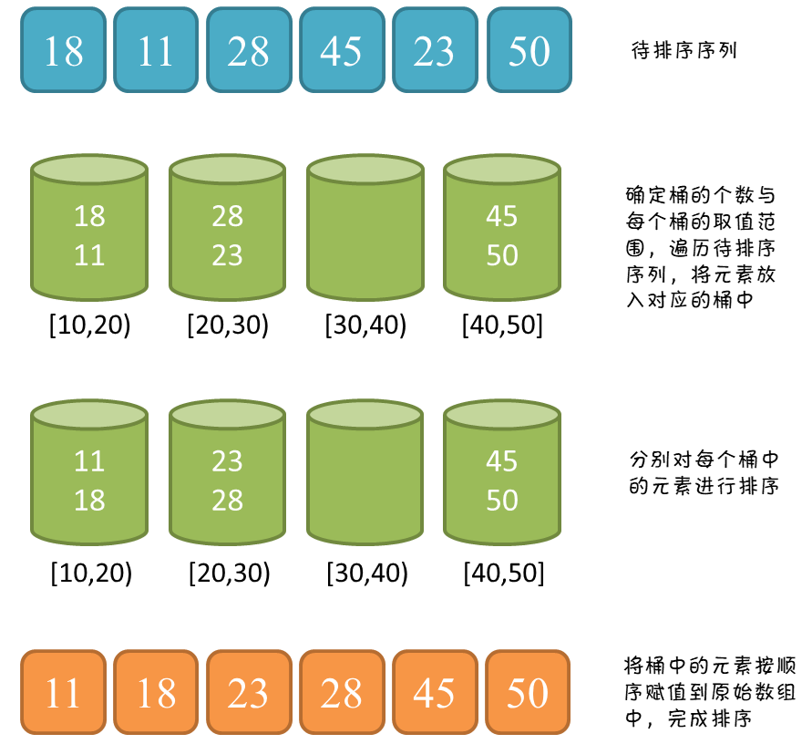

<!--
 * @Author: zhangjiaxi
 * @Date: 2021-03-05 15:18:44
 * @LastEditors: zhangjiaxi
 * @LastEditTime: 2021-03-15 09:15:04
 * @FilePath: /learning_note/sorting_algorithm.md
 * @Description: 
-->
# 算法概述
## 算法分类

### 比较类排序：通过比较来决定元素间的相对次序，由于其时间复杂度不能突破O(nlogn)，因此称为非线性时间比较类排序。
### 非比较类排序：不通过比较来决定元素间的相对次序，它可以突破基于比较排序的时间下界，以线性时间运行，因此也称为线性时间非比较类排序。


### 算法复杂度


### 相关概念
- 稳定：如果a原本在b前面，而a=b，排序之后a仍然在b的前面
- 不稳定：如果a原本在b前面，而a=b，排序之后a可能出现在b后面
- 时间复杂度：对排序数据的总的操作次数。反映当n变化时，操作次数呈现什么规律。
- 空间复杂度：是指算法在计算机内执行时所需存储空间的度量，它也是数据规模n的函数

# 冒泡排序(Bubble Sort)

冒泡排序是一种简单的排序算法。它重复地走访要排序的数列，一次比较两个元素，如果它们的顺序错误就把它们交换过来。走访数列的工作是重复地进行直到没有再需要交换，也就是说该数列已经排序完成。

## 算法描述

- 比较相邻的元素。如果第一个比第二个大，就交换它们两个
- 对每一对相邻元素作同样的工作，从开始第一对到结尾的最后一对，这样再最后的元素就会是最值
- 针对所有元素重复以上步骤，除了最后一个，直到排序完成


## 代码实现
```go
func BubbleSort(arr []int) {
	for i := len(arr) - 1; i > 0; i-- {
		for j := 0; j < i; j++ {
			if arr[j] > arr[j+1] {
				arr[j], arr[j+1] = arr[j+1], arr[j]
			}
		}

	}
}
```

# 选择排序(Selection Sort)

选择排序(Selection Sort)是一种简单直观的排序算法。它的工作原理是：首先在未排序序列中找到最值元素，存放到排序序列的起始位置，然后再从剩余未排序元素中继续寻找最值元素，然后放到已排序序列的末尾。以此类推，直到所有元素均排序完毕。

## 算法描述

n个记录的直接选择排序可经过n-1趟直接选择排序得到有序结果。具体算法描述如下：

- 初始状态：无序区为R[1..n]，有序区为空
- 第i趟排序(i=1,2,3...n-1)开始时，当前有序区和无序区分别为R(1..i-1)和R(i..n)。该趟排序从当前无序区中选出关键字最小的记录R[k]，将它与无序区的第1个记录R交换，使R[1..i]和R[i+1..n)分别变为记录个数增加1个的新有序区和记录个数减少1个的新无序区；
- n-1趟结束，数组有序化了。


## 代码实现

```go
func SelectSort(arr []int) {
	for j := 0; j < len(arr)-1; j++ {
		tmp := arr[j]
		for i := j + 1; i < len(arr); i++ {
			if arr[i] < tmp {
				tmp, arr[i] = arr[i], tmp
			}
		}
		arr[j] = tmp
	}

}
```

# 插入排序(Insertion Sort)

插入排序(Insertion Sort)的算法描述是一种简单直观的排序算法。它的工作原理是通过构建有序序列，对于未排序数据，再已排序序列中从后向前扫描，找到相应位置并插入。

## 算法描述

- 从第一个元素开始，该元素可以认为已经被排序
- 取出下一个元素，在已排序的元素序列中从后向前扫描
- 如果该元素（已排序）大于新元素，将该元素移到下一位置
- 重复步骤3,直到找到已排序元素大于或等于新元素的位置
- 将新元素插入到该位置后，重复步骤2～5


## 代码实现

```go
func InsertionSort(arr []int) {
	for i := 1; i < len(arr); i++ {
		for j := i - 1; j >= 0; j-- {
			if arr[j] > arr[j+1] {
				arr[j], arr[j+1] = arr[j+1], arr[j]
			} else {
				break
			}
		}
	}
}
```

# 希尔排序(Shell Sort)

第一个突破O(n<sup>2</sup>)的排序算法，是简单插入排序的改进版。它与插入排序的不同之处在于，它会优先比较距离较远的元素。希尔排序又叫缩小增量排序。

## 算法描述

- 将整个待排序的序列分割成若干子序列
- 选择一个增量序列t1,t2,...,tk，其中ti>tj,tk=1
- 按增量序列个数k，对序列进行k趟排序
- 每趟排序，根据对应的增量ti，将待排序列分割成若干长度为m的子序列，分别对各子表进行直接插入排序。仅增量因子为1时，整个序列作为一个表来处理，表长度即为整个序列长度。


## 代码实现

```go
func ShellSort(arr []int) {
	if len(arr) < 2 {
		return
	}
	for k := len(arr) / 2; k > 0; k /= 2 {
		for i := 0; i <= len(arr)-1-k; i++ {
			if arr[i] > arr[k+i] {
				arr[i], arr[i+k] = arr[i+k], arr[i]
			}
		}
	}
}
```

# 归并排序(Merge Sort)

归并排序时建立再归并操作上的一种有效的排序算法。该算法时采用分治法的一个典型应用。将已有序的子序列合并，得到完全有序的序列；即先使每个子序列有序，再使子序列段间有序。若将两个有序表合并成一个有序表，称为2路归并。

## 算法描述

- 把长度为n的输入序列分成两个长度为n/2的子序列
- 对这两个子序列分别采用归并排序
- 将两个排序好的子序列合并成一个最终的排序序列


## 代码实现

```go
func MergeSort(num []int) []int {
	if len(num) < 2 {
		return num
	}
	left := MergeSort(num[:len(num)/2])
	right := MergeSort(num[len(num)/2:])
	res := merge(left, right)
	return res
}

func merge(left, right []int) []int {
	res := make([]int, 0)
	m, n := 0, 0
	l, r := len(left), len(right)
	for m < l && n < r {
		if left[m] > right[n] {
			res = append(res, right[n])
			n++
			continue
		}
		res = append(res, left[m])
		m++
	}
	res = append(res, right[n:]...)
	res = append(res, left[m:]...)
	return res
}
```

# 快速排序(Quick Sort)

通过一趟排序将待排序分割成独立的两部分，其中一部分记录的关键字比另一部分的关键字都小，则可分别对这两部分记录进行排序，以达到整个序列有序。

## 算法描述

- 从数列中挑出一个元素，称为“基准”
- 重新排序数列，所有元素比基准值小的放在基准前面，所有元素比基准值大的放在基准后面，在这个分区退出之后，该基准就处于数列的中间位置。这个称为分区操作
- 递归地把小于基准值元素的子序列和大于基准值元素的子序列排序


## 代码实现

```go
func QuickSort(arr []int, start, end int) {
	if start < end {
		i := start
		j := end
		key := arr[(start+end)/2]
		for i <= j {
			for arr[i] < key {
				i++
			}
			for arr[j] > key {
				j--
			}
			if i <= j {
				arr[i], arr[j] = arr[j], arr[i]
				i++
				j--
			}
		}
		if i < end {
			QuickSort(arr, i, end)
		}
		if j > start {
			QuickSort(arr, start, j)
		}

	}
}
```

# 堆排序(Heap Sort)

利用堆这种数据结构所设计的一种排序算法。堆即是一个近似完全二叉树的结构，并同时满足堆的性质，即子节点的键值或索引总是小于（或大于）它的父节点。

## 算法描述

- 将初始化待排序关键字序列(R1,R2,...,Rn)构建成大顶堆，此堆为初始的无序区
- 将堆顶元素R1与最后一个元素Rn交换，此时得到新的无序区(R1,R2,...,Rn-1)和新的有序区(Rn)，满足R[1,2,...,n-1]<=Rn
- 由于交换后新的堆顶R1可能违反堆的性质，因此需要对当前无序区(R1,R2,...,Rn-1)调整为新堆，然后再次将R1与无序区最后一个元素交换，得到新的无序区(R1,R2,...,Rn-2)和新的有序区(Rn-1,Rn)。不断重复此过程直到有序区的元素个数为n-1，则整个排序过程完成


## 代码实现

```go
func HeapSort(arr []int, low int) {
	tmp := low / 2
	for i := tmp; i >= 0; i-- {
		if 2*i+1 <= low && arr[2*i+1] > arr[i] {
			arr[i], arr[2*i+1] = arr[2*i+1], arr[i]
		}
		if 2*i+2 <= low && arr[2*i+2] > arr[i] {
			arr[i], arr[2*i+2] = arr[2*i+2], arr[i]
		}
	}
	arr[0], arr[low] = arr[low], arr[0]
	if low > 1 {
		HeapSort(arr, low-1)
	}

}
```

# 计数排序(Counting Sort)

计数排序不是基于比较的排序算法，其核心在于将输入的数值转化为键存储在额外开辟的数组空间中。作为一种线性时间复杂度的排序，计数排序 要求输入的数据必须时有确定范围的整数。

## 算法描述

- 找出待排序的数组中最大和最小的元素
- 统计数组中每个值为i的元素出现的次数，存入数组c的第i项
- 对所有的计数累加（从c中的第一个元素开始，每一项和前一项相加）
- 反向填充目标数组，将每个元素i放在新数组的第ci项，每放一个元素就将ci减去1


## 代码实现

```go
func CountingSort(arr []int, max int) {
	bucket := make([]int, max+1)
	tmp := 0
	for _, i := range arr {
		bucket[i] += 1
	}
	for ind, j := range bucket {
		for j > 0 {
			arr[tmp] = ind
			j--
			tmp++
		}

	}
}
```

# 桶排序(Bucket Sort)

桶排序时计数排序的升级版。它利用了函数的映射关系，高效与否的关键就在于这个映射函数的确定。桶排序的工作原理：假设输入数据服从均匀分布，将数据分到有限数量的桶里，每个桶再分别排序。

## 算法描述

- 设置一个定量的数组当作空桶
- 遍历输入数据，并且把数据一个一个放到对应的桶里去
- 对每个不是空的桶进行排序
- 从不是空的桶里把排好序的数据拼接起来



## 代码实现

```go
不想实现了，唉
```

# 基数排序(Radix Sort)

基数排序是按照低位先排序，然后收集；再按照高位排序，然后再收集；依次类推，直到最高位。有时候有些属性是有优先级顺序的，先按低优先级排序，再按高优先级排序。最后的次序就是高优先级高的在前，高优先级相同的低优先级高的在前

## 算法描述

- 取得数组中的最大数，并取得位数
- arr为原始数组，从最低位开始取每个位组成radix数组
- 对radix进行计数排序


## 代码实现

```go
也不想实现
```