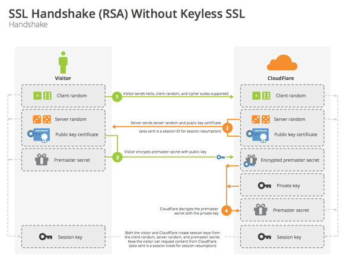
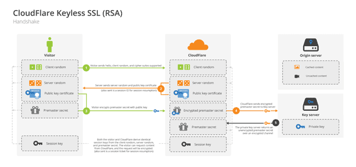
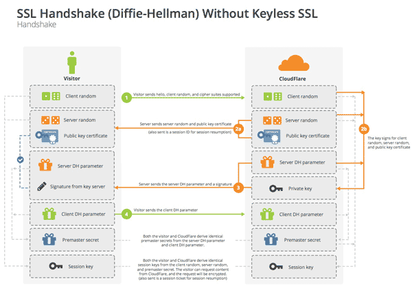
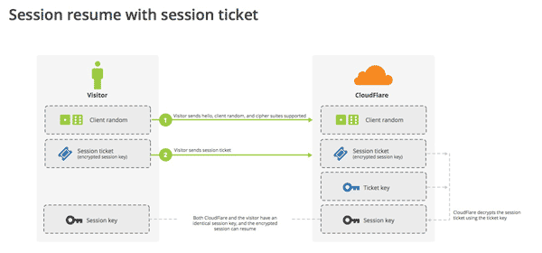

<!--
 * @Author: zhangjiaxi
 * @Date: 2021-03-03 11:40:44
 * @LastEditors: zhangjiaxi
 * @LastEditTime: 2021-03-03 15:15:11
 * @FilePath: /learning_note/ssl.md
 * @Description: 
-->
## SSL协议握手过程

1. 客户端给出协议版本号，一个客户端生成的随机数(client random)，以及客户端支持的加密方法。
2. 服务端确认双方使用的加密方法，并给出数字证书、以及一个服务器生成的随机数(server random)。
3. 客户端确认数字证书有效，然后生成一个新的随机数(Premaster secret)，并使用数字证书中的公钥，加密这个随机数发给服务端。
4. 服务端使用自己的私钥，获取客户端发来的随机数(即Premaster secret)。
5. 客户端和服务端根据约定的加密方法，使用前面的三个随机数，生成“对话密钥(session key)”，用来加密接下来的整个对话过程。
上面五步，画成一张图：

## 私钥的作用

握手阶段有三点需要注意
1. 生成对话密钥一共需要三个随机数
2. 握手之后的对话使用“对话密钥”加密（对称加密），服务器的公钥和私钥只用于加密和解密“对话密钥”（非对称加密），无其它作用
3. 服务器公钥放在服务器的数字证书之中

从上面第二点可知，整个对话过程中（握手阶段和其后的对话），服务器的公钥和私钥只需用到一次。

某些客户（比如银行）想要使用外部CDN，加快自家网站的访问速度，但是出于安全考虑，不能把私钥交给CDN服务商。这时，完全可以把私钥留在自家服务器，只用来解密对话密钥，其他步骤都让CDN服务商去完成。

上图中，服务器只参与第四步，后面的对话都不会用到私钥。

## DH算法的握手阶段

整个握手阶段都不加密（也没法加密），都是明文，因此如果有人窃听，他可以知道双方向阿unze的加密方法，以及三个随机数中的两个。整个通话的安全只取决于第三个随机数(Premaster secret)能不能被破解。

虽然理论上，只要服务器的公钥足够长（比如2048位），那么Premaster secret可以保证不被破解。但是为了足够安全，我们可以考虑把握手阶段的算法从默认的RSA算法，改为Diffe-Hellman算法（简称DH算法）。

采用DH算法后，Premaster secret不需要传递，双方只要交换各自的参数，就可以算出这个随机数。

上图中，第三步和第四步由传递Premaster secret变成了传递DH算法所需的参数，然后双方各自算出Premaster secret。这样就提高了安全性。

## session恢复

有两种方法可以恢复原来的session：一种是session ID，另一种是session ticket。

session ID的思想很简单，就是每一次对话都有一个编号(session ID)。如果对话中断，下次重连的时候，只要客户端给出这个编号，且服务器有这个编号的记录，双方就可以重新使用已有的“对话密钥”，而不必重新生成一把。

上图中，客户端给出session ID，服务器确认该编号存在，双方就不再进行握手阶段剩余的步骤，而直接用已有的对话密钥进行加密通信。

session ID是目前所有浏览器都支持的方法，但是它的缺点在于session ID往往只博阿流在一台服务器上。所以如果客户端的请求发到另一台服务器，就无法恢复对话。session ticket就是为了解决这个问题而诞生的，目前只有Firefox和Chrome浏览器支持。

上图中客户端不再发送session ID，而是发送一个服务器在上一次对话中发送过来的session ticket。这个session ticket是加密的，只有服务器才能解密，其中包括本次对话的主要信息，比如对话密钥和加密方法。当服务器收到session ticket以后，解密就不必重新生成对话密钥了。